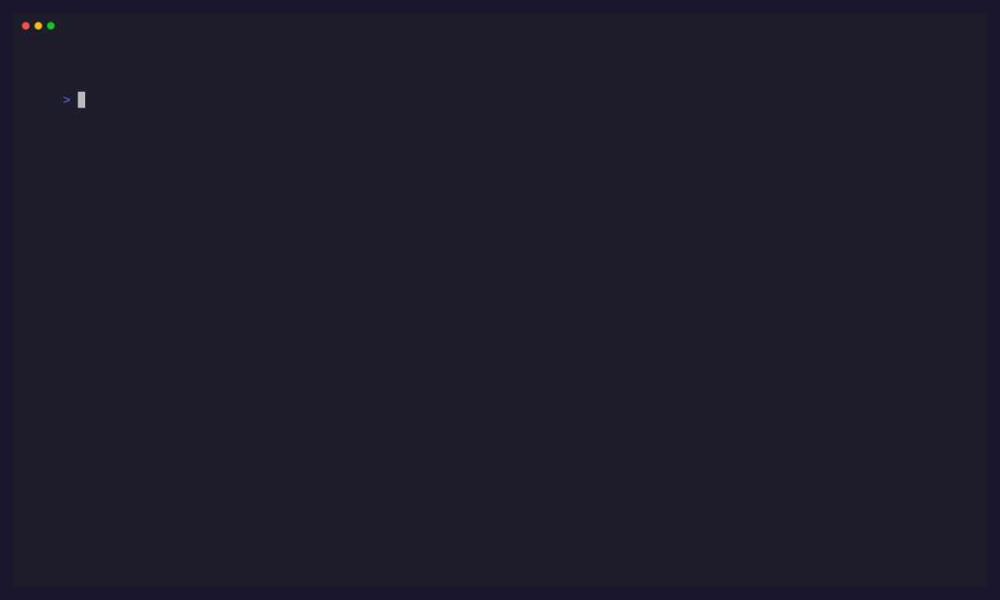

<p align="center">
  <h1 align="center">Pentest Swarm AI</h1>
  <p align="center">
    <strong>The first open-source pentesting tool built on a real swarm — not just multiple agents in a row.</strong>
  </p>
  <p align="center">
    <a href="#quick-start">Quick Start</a> &middot;
    <a href="#what-makes-this-a-swarm">Swarm vs. Multi-Agent</a> &middot;
    <a href="#how-the-swarm-works">How It Works</a> &middot;
    <a href="#comparison">Compare</a> &middot;
    <a href="IMPLEMENTATION_PLAN.md">Roadmap</a>
  </p>
</p>

<p align="center">
  
  
  
  
  
</p>

<!-- Once trendshift.io lists the repo, replace the numeric id below.
     PentAGI's badge (for reference): https://trendshift.io/repositories/15161
<p align="center">
  <a href="https://trendshift.io/repositories/__ID__" target="_blank">
    
  </a>
</p>
-->


<p align="center">
  
</p>

<p align="center">
  
</p>

> ### Credits & Inspiration
> This project stands on the shoulders of giants. We credit and thank these projects for pioneering AI-powered offensive security:
>
> - [**PentestGPT**](https://github.com/GreyDGL/PentestGPT) — the OG that proved LLMs can pentest
> - [**PentAGI**](https://github.com/vxcontrol/pentagi) — fully autonomous agent architecture
> - [**Strix**](https://github.com/usestrix/strix) — AI hackers that find and fix vulns
> - [**CAI**](https://github.com/aliasrobotics/cai) — cybersecurity AI framework, 3600x faster than humans
> - [**HackingBuddyGPT**](https://github.com/ipa-lab/hackingBuddyGPT) — LLM hacking in 50 lines of code
> - [**Shannon**](https://github.com/KeygraphHQ/shannon) — white-box AI pentester
> - [**BlacksmithAI**](https://github.com/fr0gger/BlacksmithAI) — multi-agent pentest framework
> - [**PentestAgent**](https://github.com/GH05TCREW/pentestagent) — black-box AI security testing
> - [**Pentest Copilot**](https://github.com/bugbasesecurity/pentest-copilot) — AI-driven pentest agent
>
> Their open-source contributions made tools like this possible.

> **Legal Disclaimer:** Pentest Swarm AI is designed exclusively for **authorized security testing**, **bug bounty programs**, **CTF competitions**, and **educational research**. You must obtain explicit written permission from the target system owner before running any scan. Unauthorized access to computer systems is illegal under the Computer Fraud and Abuse Act (CFAA), the Computer Misuse Act, and equivalent laws worldwide. The authors and contributors of this project accept **no liability** for misuse, damage, or any illegal activity conducted with this tool. By using this software, you agree that you are solely responsible for ensuring your use complies with all applicable laws and regulations. **Do not use this tool against systems you do not own or have explicit authorization to test.**

---

## What makes this a swarm?

Most "multi-agent" pentesting tools are a single planner LLM dispatching to specialist agents in a fixed order — recon → classify → exploit → report. That's a **pipeline**, not a swarm.

Pentest Swarm AI is built around three swarm-intelligence primitives:

- **Stigmergy** — agents coordinate by reading and writing findings on a shared blackboard, not by a central planner telling them what to do. A finding's *pheromone weight* biases other agents toward it and decays over time, so stale paths die naturally.
- **Emergence** — attack chains appear that no single agent planned. A recon finding wakes the classifier; a high-severity classification wakes the exploit agent; exploit results feed back into the board and wake the report agent. Order isn't prescribed — it emerges from the blackboard state.
- **Decentralization** — each agent runs its own *trigger predicate*. Add a new agent with its own predicate and it joins the swarm without anyone rewriting the orchestrator.

We built this because the category was empty. Every tool marketed as "swarm" was actually a pipeline. If you find a counter-example, open an issue — we'll add them to the [comparison table](#comparison).

See [**IMPLEMENTATION_PLAN.md**](IMPLEMENTATION_PLAN.md) for the technical deep-dive on stigmergy, pheromone decay, the Postgres-backed blackboard, and why we didn't build on Google ADK / CrewAI / AutoGen.

---

## Quick Start

```bash
# Install (pick one)
brew install Armur-Ai/tap/pentestswarm            # macOS (Homebrew tap)
docker run --rm -e ANTHROPIC_API_KEY=sk-ant-... \
  ghcr.io/armur-ai/pentestswarm:latest \
  scan example.com --scope example.com             # Docker one-liner
go install github.com/Armur-Ai/Pentest-Swarm-AI/cmd/pentestswarm@latest  # Go

# One API key, one command, one swarm.
export PENTESTSWARM_ORCHESTRATOR_API_KEY=sk-ant-your-key-here
pentestswarm scan example.com --scope example.com --swarm --follow
```

That's the whole setup. No Ollama, no model download, no GPU — just a Claude API key.

Running inside a GitHub Actions workflow? There's an action for that — see [`deploy/github-action/example-workflow.yml`](deploy/github-action/example-workflow.yml).

---

## How the swarm works

```
                         YOU
                          |
                   pentestswarm scan example.com --swarm
                          |
               ┌──────────▼──────────┐
               │   SEED: TARGET_REG  │
               └──────────┬──────────┘
                          ▼
     ┌────────────────────────────────────────────────────────┐
     │              SHARED BLACKBOARD (pgvector)              │
     │                                                        │
     │   SUBDOMAIN · PORT_OPEN · HTTP_ENDPOINT · TECHNOLOGY   │
     │   CVE_MATCH · MISCONFIGURATION · EXPLOIT_CHAIN         │
     │   EXPLOIT_RESULT · CAMPAIGN_COMPLETE                   │
     │                                                        │
     │   (each finding has a pheromone weight that decays)    │
     └──┬─────────────┬─────────────┬─────────────┬───────────┘
        │             │             │             │
        │ triggers:   │ triggers:   │ triggers:   │ triggers:
        │ TARGET_REG  │ raw recon + │ CVE_MATCH   │ CAMPAIGN_
        │             │ pheromone>  │ pheromone>  │ COMPLETE
        │             │ 0.2         │ 0.5         │
        ▼             ▼             ▼             ▼
   ┌─────────┐  ┌─────────┐   ┌─────────┐   ┌─────────┐
   │  RECON  │  │CLASSIFY │   │ EXPLOIT │   │ REPORT  │
   │         │  │         │   │         │   │         │
   │ runs 8  │  │ maps    │   │ builds  │   │ queries │
   │ tools,  │  │ CVEs,   │   │ attack  │   │ board   │
   │ writes  │  │ scores  │   │ chains  │   │ →md/    │
   │ per     │  │ CVSS,   │   │ per     │   │ html/   │
   │ finding │  │ writes  │   │ finding │   │ json/   │
   └─────────┘  └─────────┘   └─────────┘   │ sarif   │
                                            └─────────┘
```

Key behaviours:

1. **Agents are independent.** Any one of them can be removed, replaced, or added without rewiring the others.
2. **Pheromones decay per-finding-type.** A `PORT_OPEN` stays hot for hours; a `SESSION` for minutes. Config-driven half-lives.
3. **Scope is enforced at the tool layer and again at the executor.** Defence in depth — `--scope` is not bypassable.
4. **Cleanup is always registered before execution.** SIGINT, crashes, and budget exhaustion all trigger reverse-order cleanup. See `internal/pipeline/cleanup_memory.go` and `cleanup.go`.
5. **Prompt caching on Claude** cuts cost and latency on repeated system prompts (enabled by default for recon + classifier).

---

## Comparison

How we position vs. the rest of the ecosystem. We'll ship real benchmark numbers in a future release (see [Phase 3.3](IMPLEMENTATION_PLAN.md#phase-33--benchmarks-the-credibility-lever)).

| Tool | Architecture | Executes vs. suggests | Memory | Tools wired | MCP | Swarm? |
|---|---|---|---|---|---|---|
| **Pentest Swarm AI** | Stigmergic blackboard | Executes | pgvector + pheromones | 8 ProjectDiscovery + nmap; sqlmap / Burp MCP / Metasploit in roadmap | Yes | ✅ real |
| PentestGPT | Single-agent ReAct | Suggests | None | None native | No | No |
| HackingBuddyGPT | Single-agent | Executes | Run logs | Shell passthrough | No | No |
| PentAGI | 4 agents + planner | Executes | pgvector | 40+ via MCP/shell | Partial | Pipeline |
| Shannon | White-box + browser | Executes | Session state | Browser DOM | No | Pipeline |
| HexStrike | MCP tool wrapper | Delegates to client LLM | None (stateless) | 150+ via MCP | Yes | No |
| Pentest-R1 | RL-tuned LLM | Executes | Trajectory | CTF-scope | No | No |

If any entry here is wrong or out of date, please open a PR — we want this table to stay honest.

---

## Feature status

Honesty labels: *stable* means shipped + tested, *beta* means works but rough edges, *alpha* means experimental, *planned* means in the [roadmap](IMPLEMENTATION_PLAN.md).

| Feature | Status | Notes |
|---|---|---|
| Sequential 5-phase runner | **stable** | Default mode; battle-tested core |
| Stigmergic swarm scheduler | **alpha** | `--swarm` flag; memory-backed blackboard wired |
| ProjectDiscovery toolchain | **stable** | subfinder, httpx, nuclei, naabu, katana, dnsx, gau |
| `nmap` adapter | **stable** | XML parsed; scope-validated |
| Cleanup registry | **stable** | Always runs on SIGINT / exit / budget-cancel |
| Claude prompt caching | **stable** | Enabled for recon + classifier by default |
| `--strict` LLM mode | **stable** | Promotes LLM errors to fatal |
| CVSS v3.1 scoring | **stable** | FIRST spec |
| Postgres blackboard backend | **beta** | Migration shipped; runner uses memory-board for now |
| MCP server | **beta** | `pentestswarm mcp serve` |
| VS Code extension | **beta** | `deploy/vscode/` |
| GitHub Action | **beta** | `deploy/github-action/action.yml` with SARIF |
| Swarm playbooks (5) | **beta** | `playbooks/{bug-bounty,external-asm,ci-cd,internal-network,ctf-solver}.yaml` |
| Live dashboard | **alpha** | `web/`; UI built, wiring to live campaigns in progress |
| Burp MCP bridge | **planned** | Wave 2 |
| Metasploit / ZAP / sqlmap adapters | **planned** | Wave 2 |
| Fine-tuned Pentest-Swarm model | **planned** | Wave 3 (Pentest-R1 recipe) |
| Cybench / AutoPenBench benchmarks | **planned** | Wave 3 |

---

## CLI

```bash
pentestswarm scan <target> --scope <scope>              # Launch the swarm
pentestswarm scan <target> --scope <scope> --swarm      # Use the stigmergic scheduler
pentestswarm scan <target> --scope <scope> --strict     # Fail on LLM errors
pentestswarm campaign watch <id>                        # Live TUI — watch agents work
pentestswarm campaign explore <id>                      # Browse attack surface interactively
pentestswarm playbook run <name> --target <t>           # Run a community playbook
pentestswarm doctor                                     # 8-point system health check
pentestswarm mcp serve                                  # MCP server for Claude/Cursor
pentestswarm serve                                      # Start API server + dashboard
```

---

## LLM Providers

All agents inherit from a single provider config. Set one key, the entire swarm works.

| Provider | Setup | Privacy | Best for |
|----------|-------|---------|----------|
| **Claude** (default) | `export PENTESTSWARM_ORCHESTRATOR_API_KEY=...` | Cloud | Best quality, zero setup, prompt caching |
| **Ollama** | Install Ollama + pull models | 100% local | Full privacy, air-gapped |
| **LM Studio** | Load model, enable server | 100% local | GUI model management |

---

## Tech Stack

| Component | Technology | Why |
|-----------|-----------|-----|
| Platform | **Go 1.24** | Single binary, goroutine concurrency, native security tools |
| CLI | **Cobra + bubbletea** | Beautiful TUI with multi-panel agent view |
| LLM | **Claude API / Ollama / LM Studio** | Best quality cloud + full privacy local |
| Security Tools | **subfinder · httpx · nuclei · naabu · katana · dnsx · gau · nmap** | ProjectDiscovery Go libs + nmap subprocess |
| Blackboard | **Postgres 16 + pgvector** | Transactional writes, vector similarity, pheromone decay in SQL |
| Cache | **Redis 7** | Rate limiting, session state |
| Dashboard | **Next.js 15 + shadcn/ui + tremor** | Dark-first, chart-heavy |
| MCP | **JSON-RPC stdio** | Claude Desktop + Cursor integration |

---

## Development

```bash
git clone https://github.com/Armur-Ai/Pentest-Swarm-AI.git
cd Pentest-Swarm-AI
./scripts/setup.sh    # Install tools, start Postgres/Redis/Ollama
make build            # Compile binary
make test             # Run tests
make dev              # Hot-reload development
```

Regenerate the demo GIF after any CLI change:

```bash
brew install vhs      # one-off
vhs docs/demo.tape
```

---

## Roadmap

See [**IMPLEMENTATION_PLAN.md**](IMPLEMENTATION_PLAN.md) for the full phased plan. Short version:

- **Wave 1** (in flight): real swarm architecture (done), dashboard wire-up, Burp MCP
- **Wave 2**: sqlmap / Metasploit / ZAP adapters, bug-bounty + ASM + CI/CD playbook polish, official GitHub Action in Marketplace
- **Wave 3**: fine-tuned Pentest-Swarm model (Pentest-R1 recipe), Cybench / AutoPenBench / CVE-Bench numbers, agent-memory poisoning hardening (MINJA / MemoryGraft defences)

---

## Why "Swarm"?

Single agents are tools. Pipelines dressed up as agents are slightly fancier tools. A **swarm** is different: agents share an environment, each agent's writes influence other agents' behaviour, and the useful work is emergent rather than prescribed. That's what lets a swarm handle a 1,000-subdomain target without anyone writing a plan for it.

**One agent is a tool. A swarm is a platform.**

---

## License

Apache 2.0 — see [LICENSE](LICENSE).

Built by [Armur AI](https://github.com/Armur-Ai).
